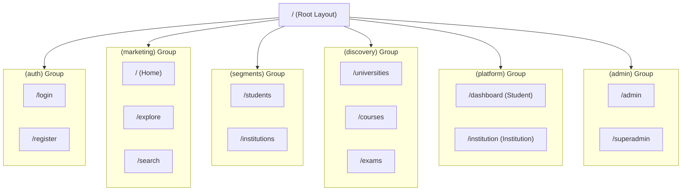

# USG INDIA — EXTREME PROFESSIONAL FRONTEND ARCHITECTURE v2.0

## 1. Executive Summary
This document outlines the architectural blueprint for version 2.0 of the USG India frontend platform. The goal is to transition from a standard Next.js application to a "World-Class Education Platform" capable of handling multi-tenant experiences (Student, Institution, Admin), massive content discovery (canonical entities), and complex decision-making tools.

## 2. Technical Stack & Foundation
*   **Framework:** Next.js 16 (App Router)
*   **Language:** TypeScript
*   **Styling:** Tailwind CSS 4 + Shadcn UI
*   **State Management:** Zustand (Global) + React Query (Server State)
*   **Auth:** Supabase Auth (with RBAC)
*   **Database:** Supabase (PostgreSQL)
*   **Real-time:** Socket.io (Chat/Notifications) / Supabase Realtime

## 3. High-Level Directory Structure (Proposed)

We will adopt a **Domain-Driven Design (DDD)** approach mapped to Next.js App Router Route Groups to separate concerns and layouts.



```
frontend/src/
├── app/
│   ├── (auth)/                 # Authentication Flows
│   │   ├── login/
│   │   ├── register/
│   │   └── forgot-password/
│   │
│   ├── (marketing)/            # Public Root / Global System (SEO Heavy, SSG/ISR)
│   │   ├── page.tsx            # Home (Personalized Landing)
│   │   ├── explore/            # Discovery Hub
│   │   ├── search/             # Global Search
│   │   ├── about/              # Trust & Transparency
│   │   └── ...                 # Other root pages (Trending, Popular)
│   │
│   ├── (segments)/             # Public Entry Segments (Targeted Landing)
│   │   ├── students/
│   │   ├── institutions/
│   │   ├── partners/
│   │   └── ...
│   │
│   ├── (discovery)/            # Canonical Discovery Entities (The "Wikipedia" of Data)
│   │   ├── universities/       # /universities/[slug]
│   │   ├── courses/            # /courses/[slug]
│   │   ├── careers/            # /careers/[slug]
│   │   ├── exams/              # /exams/[slug]
│   │   └── scholarships/       # /scholarships/[slug]
│   │
│   ├── (tools)/                # Tools Platform
│   │   ├── tools/
│   │   ├── decision/           # Decision & Simulation System
│   │   └── compare/
│   │
│   ├── (knowledge)/            # Knowledge System
│   │   └── knowledge/
│   │
│   ├── (platform)/             # Authenticated App Experience (Dashboards)
│   │   ├── dashboard/          # Student/User Dashboard
│   │   ├── institution/        # Institution Dashboard (B2B)
│   │   ├── contributor/        # Contributor Dashboard
│   │   └── settings/
│   │
│   ├── (admin)/                # Internal Admin Panels
│   │   ├── admin/
│   │   └── superadmin/
│   │
│   ├── api/                    # Route Handlers
│   ├── global-error.tsx
│   ├── layout.tsx              # Root Layout (Providers)
│   └── not-found.tsx
│
├── components/
│   ├── global/                 # Shared across all domains (Navbar, Footer)
│   ├── ui/                     # Atomic UI Components (Shadcn)
│   ├── domains/                # Domain-specific components
│   │   ├── auth/
│   │   ├── marketing/
│   │   ├── discovery/
│   │   ├── dashboard/
│   │   └── ...
│   └── layouts/                # Complex layout components
│
├── lib/
│   ├── api/                    # API clients (Server & Client)
│   ├── constants/
│   ├── hooks/
│   ├── store/                  # Global Stores (Zustand)
│   └── utils/
│
└── types/                      # Global Type Definitions
```

## 4. Key Systems Implementation Strategy

### 4.1 Routing Paradigm & Navigation
*   **Route Groups:** Use `(group)` folders to apply distinct layouts (e.g., Marketing Layout vs. Dashboard Layout).
*   **Dynamic Routes:** Extensive use of `[slug]` for SEO-friendly URLs (e.g., `/universities/iit-bombay`).
*   **Parallel Routes:** Use `@slot` for complex dashboards to load independent sections simultaneously.
*   **Intercepting Routes:** Use `(.)` for modals (e.g., opening a photo gallery or quick view without leaving the page).

### 4.2 State Management (Global Layers)
Using **Zustand** for client-side global state, split into slices:
*   `useAuthStore`: User session, role, permissions.
*   `useUIStore`: Sidebar state, theme, modal manager, global toasts.
*   `useNavigationStore`: Breadcrumbs, history stack, tab sync.
*   `useSearchStore`: Global search query, filters, recent searches.

### 4.3 Performance Strategy
*   **ISR (Incremental Static Regeneration):** For high-traffic public pages (Universities, Exams) to ensure fast load times and fresh data (revalidate: 3600).
*   **Streaming (Suspense):** Wrap slow data fetching components in `<Suspense>` to show skeletons immediately.
*   **Image Optimization:** Use `next/image` with Cloudinary/AWS loader.

### 4.4 SEO Strategy
*   **Metadata API:** Generate dynamic metadata for every page (Title, Description, OpenGraph, JSON-LD).
*   **Sitemap:** Dynamic `sitemap.ts` generating URLs for all entities.
*   **Canonical Tags:** Ensure no duplicate content penalties.

## 5. Migration Phases

### Phase 1: Foundation & Restructuring
*   Establish the directory structure with Route Groups.
*   Move existing `(public)` pages to `(marketing)`.
*   Move existing `(dashboard)` pages to `(platform)`.
*   Implement the "Global Frontend Meta-Foundation" (Theme, Fonts, i18n setup).

### Phase 2: Core Discovery Entities (The "Public Data Core")
*   Build the `(discovery)` routes: Universities, Courses, Careers.
*   Implement the "Canonical Page" layout (Hero, Info, Tabs, Sidebar).

### Phase 3: The "Exams" System
*   Build the comprehensive Exams module (`/exams`).
*   Implement "Sarkari Result Style" lists and filters.

### Phase 4: User Dashboard (Academic OS)
*   Enhance `(platform)/dashboard`.
*   Implement "Resume", "Deep Context Restore", and "Tab Sync".

### Phase 5: Specialized Platforms
*   Implement `(tools)`, `(knowledge)`, and `(institution)`.

### Phase 6: Admin & Optimization
*   Finalize Admin panels.
*   Audit Accessibility (WCAG 2.2 AAA).
*   Performance Tuning (Core Web Vitals).
